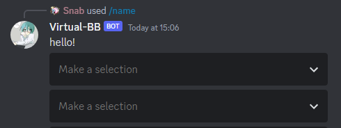

# Message Components

Message components are the interactive buttons and select menus you'll see on
some messages sent by bots.

### Making a Component Client

The Component client keeps track of registered components and handles
executing them.

This can be created with any of the following class methods:

* [ComponentClient.from_gateway_bot][yuyo.components.ComponentClient.from_gateway_bot]:
    Create a component client from a Hikari gateway bot (i.e.
    [hikari.GatewayBot][hikari.impl.gateway_bot.GatewayBot]).
* [ComponentClient.from_rest_bot][yuyo.components.ComponentClient.from_rest_bot]:
    Create a component client from a Hikari REST bot (i.e.
    [hikari.RESTBot][hikari.impl.rest_bot.RESTBot] or [yuyo.asgi.AsgiBot][]).
* [ComponentClient.from_tanjun][yuyo.components.ComponentClient.from_tanjun]:
    Create a component client from a Tanjun [Client][tanjun.abc.Client].

    This method will make the component client use Tanjun's Alluka client for
    dependency injection, essentially mirroring the dependencies registered for
    Tanjun's DI while also registering
    [ComponentClient][yuyo.components.ComponentClient] as a type dependency.

Client state can be managed through dependency injection. This is implemented using
[Alluka][alluka] and more information about it can be found in Alluka's
[usage guide](https://alluka.cursed.solutions/usage/). The Alluka client
used for component execution can be found at
[ComponentClient.alluka][yuyo.components.ComponentClient.alluka].

For the sake of simplicity, the following examples all assume the component
client can be accessed through Alluka style dependency injection.

### Types of components

##### Buttons


Message buttons have several different styles, as shown above. Most of these
are interactive, meaning that an interaction will be sent to the bot when a
user clicks on it. The only non-interactive style is link buttons which
simply open the set link in a browser for the user who clicked on it.

A row can have up to 5 buttons in it.

### Select Menus



Select menus let users select between 0 to 25 options (dependent on how the bot
configured it). These selections are communicated to the bot once the user has
finished selecting options via an interaction and there's several different
resources they can be selecting:

* Text menus: lets the bot pre-define up to 25 text options
* User menus: lets the user pick up to 25 users
* Role menus: lets the user pick up to 25 roles
* Channel menus: lets the user pick up to 25 channels
* Mentionable menus: lets the user pick up to 25 roles and users

!!! note
    As of writing user, role, channel and mentionable menus only let you select
    entities from the current guild. Only text menus work properly in DM
    channels.

Each select menu takes up a whole row.

### Declaring Components

When adding sub-components to a select menu, they'll either be appended to the
last row or they'll be added to a new row if the new entry wouldn't fit in the
last row.

A message can only have up to 5 component rows on it.

There's several different ways to declare components using Yuyo:

### Subclassing

```py
--8<-- "./docs_src/components.py:32:55"
```

When subclassing [ActionColumnExecutor][yuyo.components.ActionColumnExecutor],
you can use any of the following class descriptors to add "static"
sub-components (which'll be included on every instance and subclass of the
column) to it:

* [as_channel_menu][yuyo.components.as_channel_menu]
* [as_interactive_button][yuyo.components.as_interactive_button]
* [as_mentionable_menu][yuyo.components.as_mentionable_menu]
* [as_role_menu][yuyo.components.as_role_menu]
* [as_text_menu][yuyo.components.as_text_menu]
* [as_user_menu][yuyo.components.as_user_menu]
* [link_button][yuyo.components.link_button]

```py
--8<-- "./docs_src/components.py:59:64"
```

Most of these descriptors decorate a callback which'll be called when that
specific sub-component is used by a user, with the only exception being
link buttons which open a link for the user instead of sending an interaction
to the bot.

!!! warning
    If you declare `__init__` on an
    [ActionColumnExecutor][yuyo.components.ActionColumnExecutor] subclass
    then you must make sure to first call `super().__init__()` in it.

```py
--8<-- "./docs_src/components.py:69:80"
```

Alternatively, static sub-components can be added to an
[ActionColumnExecutor][yuyo.components.ActionColumnExecutor] subclass using its
chainable `add_static_{}` class methods.

```py
--8<-- "./docs_src/components.py:85:104"
```

Or by using its `with_static_{}` decorator class methods. The only
sub-component type which cannot be added through a decorator call is link
buttons.

!!! note
    [column_template][yuyo.components.column_template] just provides a shorthand
    for creating an [ActionColumnExecutor][yuyo.components.ActionColumnExecutor]
    subclass and all of these class methods also work on a normal class.

### Builder

```py
--8<-- "./docs_src/components.py:109:120"
```

You can also dynamically build a
[ActionColumnExecutor][yuyo.components.ActionColumnExecutor] after initialising
it by using its chainable `add_{}` methods to add sub-components.

```py
--8<-- "./docs_src/components.py:125:144"
```

Or by using its `with_{}` decorator methods. The only sub-component type which
can't be added through a decorator call is link buttons.

### Handling Component Interactions

There's two main ways to handle component interactions with Yuyo:

##### Stateful

```py
--8<-- "./docs_src/components.py:148:164"
```

Subclassing [ActionColumnExecutor][yuyo.components.ActionColumnExecutor] allows
you to associate state with a specific message's components through OOP.

When doing this you'll usually be creating an instance of the components column
per message.

[ComponentClient.register_executor][yuyo.components.ComponentClient.register_executor]
defaults `timeout` to a 30 second sliding timeout (meaning that the timer
resets every use).

##### Stateless

```py
--8<-- "./docs_src/components.py:168:184"
```

Alternatively, components can be reused by registering the component to the client
on startup with `timeout=None` and sending the same component's rows per-execution.

Custom IDs have some special handling which allows you to track some metadata
for a specific message's components. They are split into two parts as
`"{match}:{metadata}"`, where the "match" part is what Yuyo will use to find
the executor for a message's components and the "metadata"
([ComponentContext.id_metadata][yuyo.components.BaseContext.id_metadata]) part
represents any developer added metadata for that specific instance of the
component.

The `id_metadata` init argument lets you set the metadata for the static
components in an action column while initiating it by passing a dict of
match IDs/descriptor callback names to the metadata for each specified
component.

Custom IDs cannot be longer than 100 characters in total length and the
match parts of the custom IDs in an executor have to be globally unique
when registering it globally (i.e. without passing `message=`).

!!! note
    For stateless components like described/above to work properly the match
    part of custom IDs needs to stay the same between bot restarts.

    The `as_` descriptors achieve this by generating a constant default ID from
    the path for the component's callback (which consists of the callback's
    name and the qualnames of the class and the relevant modules). This does,
    however, mean that any changes to the function's name or the name of the
    class/modules it's in will change this generated custom ID leading to it
    no-longer match any previously declared message components.

    However, the `add_` and `with_` (class)methods generate a random default
    whenever called and will have to be manually supplied a constant custom ID
    through the optional `custom_id` argument. The `as_` descriptors also have
    a `custom_id` argument which overrides the default path generated ID.

### Responding to Components

```py
--8<-- "./docs_src/components.py:188:194"
```

[ComponentContext.respond][yuyo.components.BaseContext.respond] is used to
respond to an interaction with a new message, this has a similar signature
to Hikari's message respond method but will only be guaranteed to return a
[hikari.Message][hikari.messages.Message] object when `ensure_result=True` is
passed.

##### Ephemeral responses

```py
--8<-- "./docs_src/components.py:198:202"
```

Ephemeral responses mark the response message as private (so that only the
author can see it) and temporary. A response can be marked as ephemeral by
passing `ephemeral=True` to either
[ComponentContext.create_initial_response][yuyo.components.ComponentContext.create_initial_response]
(when initially responding to the interaction with a message response) or
[ComponentContext.create_followup][yuyo.components.BaseContext.create_followup]
(for followup responses).

##### Deferrals

Interactions need an initial response within 3 seconds but, if you can't give a
response within 3 seconds, you can defer the first response using
[ComponentContext.defer][yuyo.components.ComponentContext.defer].

A deferral should then be finished by editing in the initial response using either
[ComponentContext.edit_initial_response][yuyo.components.BaseContext.edit_initial_response]
or [ComponentContext.respond][yuyo.components.BaseContext.respond] and if you
want a response to be an ephemeral message create then you'll have to pass
`ephemeral=True` when deferring.

##### Updating the source message

```py
--8<-- "./docs_src/components.py:206:209"
```

You can also use the initial response to edit the message the component being
used is on. To do this you need to pass
`response_type=hikari.ResponseType.MESSAGE_UPDATE` while calling
[ComponentContext.create_initial_response][yuyo.components.ComponentContext.create_initial_response].
After doing this any further calls to
[ComponentContext.delete_initial_response][yuyo.components.BaseContext.delete_initial_response]
and [ComponentContext.edit_initial_response][yuyo.components.BaseContext.edit_initial_response]
will target the source message as well.

You cannot change the ephemeral state of the source message.

You need to pass `response_type=hikari.ResponseType.DEFERRED_MESSAGE_UPDATE`
When deferring with the intent to update the source message.

##### Modal responses

You can also create a Modal prompt as the initial response to a component
interaction.

For more information on how to handle modals see the [Modals usage guide](../modals), where
[ComponentContext.create_modal_response][yuyo.components.ComponentContext.create_modal_response]
should be used to create the initial prompt.

### Other Executors

##### Pagination

Yuyo provides a standard component paginator implementation through
[components.ComponentPaginator][yuyo.components.ComponentPaginator].

```py
--8<-- "./docs_src/components.py:213:218"
```

This paginator takes iterators/generators of [yuyo.pagination.Page][]s and will
only push the iterator forwards as the user interacts with the paginator. This
allows for lazily generating responses.

Because of this you must use [iter][] before passing a list of pre-built data
to its init.

```py
--8<-- "./docs_src/components.py:226:227"
```

This also supports asynchronous iterators/generators, allowing for functionality
like fetching data as the user scrolls through it.

```py
--8<-- "./docs_src/components.py:231:238"
```

The paginator only enables 3 buttons by default: step backwards, stop and step
forwards. To enable the other 2 buttons or even just customise these buttons
(i.e. set a specific custom_id or emoji/label) you should pass `triggers=[]` to
[ComponentPaginator.\_\_init\_\_][yuyo.components.ComponentPaginator.__init__]
to disable the default triggers then use the provided builder methods as shown
above.

You can also add your own buttons to this alongside the pagination buttons using
the methods provided by [ActionColumnExecutor][yuyo.components.ActionColumnExecutor].
