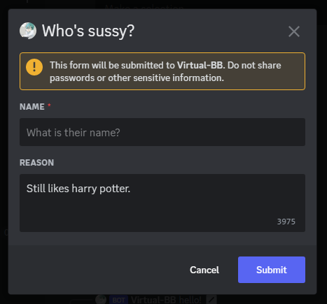

# Modals

Modals allow bots to prompt a user for more information as the initial response
for a slash command, context menu or message component interaction.



Modals take the shape of dialogue boxes which show up on top of everything for
the user who triggered the relevant interaction (as shown above) and only
support text input right now.

### Declaring Modals

There's several different ways to declare modals using Yuyo:

```py
--8<-- "./docs_src/modals.py:27:29"
```

```py
--8<-- "./docs_src/modals.py:33:42"
```

```py
--8<-- "./docs_src/modals.py:46:48"
```

```py
--8<-- "./docs_src/modals.py:52:60"
```

### Handling Modal Interactions

There's two ways to handle modal interactions with Yuyo:

##### Stateful

```py
--8<-- "./docs_src/modals.py:64:76"
```

Subclassing [Modal][yuyo.modals.Modal] allows you to associate state with a
specific modal execution through OOP.

When doing this you'll usually be creating an instance of the modal per
interaction and associating this with a specific modal execution by using
the parent interaction's custom ID as the modal's custom ID (as shown above).

[ModalClient.register_modal][yuyo.modals.ModalClient] defaults `timeout` to a 30
second one use timeout.

##### Stateless

```py
--8<-- "./docs_src/modals.py:80:96"
```

Alternatively, modals can be reused by using a global custom ID and registering the
modal to the client on startup with `timeout=None` and sending the same modal's
rows per-execution.

Custom IDs have some special handling which allows you to track some metadata
for specific modal executions. Custom IDs are split into two parts as
`"{match}:{metadata}"` where the "match" part is what Yuyo will use to find the
executor for a modal call and the "metadata"
([ModalContext.id_metadata][yuyo.components.BaseContext.id_metadata]) part
represents any developer added metadata for the modal.

If should be noted that Custom IDs can never be longer than 100 characters in
total length.
